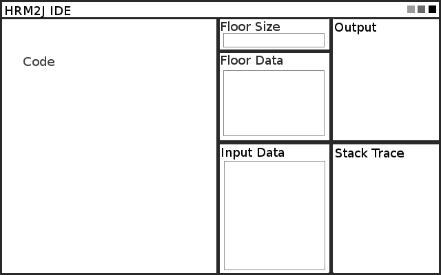

# HRM2J
### Compile Human Resource Machine code into Java.

## About
This provides many ways to run HRM assembly. Compile or interpret.
This is not for testing human resource machine solutions, but instead for running them.
HRM2J does not provide any errors if your code does not work (hrm will complain that your number is outside -999 to 999).
HRM2J can store numbers in the range of -1073741825 to 1073741823 before things start to get weird when your numbers turn into characters instead.
HRM2J will not complain if your numbers are out of range, or you are trying to IO to a box that doesn't exist.

## Why should I use this instead of other interpreters?
HRM2J does not interpret the hrm assembly, instead it converts it into java. This gives a huge speed improvement.

|Program|Time(ms/1000 runs)|
|-----|-----|
|HRM2J (Fast)|76|
|HRM2J (Interpret)|97|
|HRM2J (Bytecode NYI)|???|
|[hrmsandbox](https://github.com/sixlettervariables/hrmsandbox)|602|

Benchmark was performed with [this code (for level 41)](https://github.com/atesgoral/hrm-solutions/blob/9c92d7137f6a7593ab35389ab284fd3dcebd2a74/solutions/41-Sorting-Floor-34.714/20.651.selection-sniperrifle2004.asm),
being measured on 1000 runs. The measure was in running only, parsing the input data. The input data consisted of 61 characters:
```
1,2,3,4,0,4,3,2,1,0,1,3,3,2,2,1,4,0,4,3,2,1,4,3,2,1,4,3,2,1,0,2,1,3,4,7,8,3,2,1,4,6,0,2,7,3,5,1,2,3,0,4,3,1,2,4,2,3,1,4,0
```

## Runtime
### Error reporting
This runtime is much more efficient than the default HRM runner. This is partially due to
the lack of error checking. There is no error checking in this program. If you break something,
you might just discover it in a crash or a int under or overflow.
### Number range
This program can display all numbers, except for those in this range: 1073741856 -> 1073741951.
In practice, this small gap isn't a big deal as the default HRM language only allows numbers
within -999 -> 999, so any code that will work in the default game will work here.
This program can display all (maybe most) of the ASCII characters
``` ,!,",#,$,%,&,',(,),*,+,,,-,.,/,0,1,2,3,4,5,6,7,8,9,:,;,<,=,>,?,@,A,B,C,D,E,F,G,H,I,J,K,L,M,N,O,P,Q,R,S,T,U,V,W,X,Y,Z,[,\,],^,_,`,a,b,c,d,e,f,g,h,i,j,k,l,m,n,o,p,q,r,s,t,u,v,w,x,y,z,{,|,},~,```
This program will display them all:
```
-- EXTENDED HUMAN RESOURCE MACHINE PROGRAM --
setup:
	load 1073741855 -- first char is at 1073741856 (0b0100000)
	copyto 0
loop: -- inc, output, check if done
	inc 0
	output
	load 1073741951 -- last char is at 1073741951  (0b1111111)
	jumpeq 0 done
	jump loop
done:

```

## The GUI
The gui is still in development, and isn't very user-friendly, but is gets the job done.
In the code area, there is makeshift syntax highlighting as well as autocompletion.
The input area, the floor data must be entered as two entries per line.
For example if you want spot 0 to have a 1, spot 1 to have a 10 and spot 2 to have an 'a' do this:
```
0 1
1 10
2 a
```
The input data is entered as a long string separated by commas. For example
```
1,2,3,4,a,b,c
```
In both of these you can use letters and numbers and we can guess what data type it is without
quotes. If you specifically want a character (like the char 1, not the number), you can surround it with
single quotes like '1'. The input data could consist of 
```
1,'1'
```
Outboxing both will yield the same output, but try adding them, and you will get 1073741874, instead of 2.

### Planned
The following diagram is a plan for the graphical interface.


### Current
The following is a screenshot from the GUI in development.


## The Future
There are some plans on what this project is going to turn into.

  1. Expanding the HRM assembly language
    - Improve the language by adding more commands.
    - This already has an experimental 'load' command, which can load any value into your hand.
    - Includes a 'jumpeq' and 'crash' command now as well
  2. Interpret the language
   - In-depth debugging and running the code without compiling.
  3. Compiling to Bytecode
   - This will give huge speed improvements.
   - We will write a .class file without the creation .java files.
   - We can use Bytecode's goto command, rather than having to have methods that are called.
   This will also prevent stack overflow errors with *very* large hrm programs.
